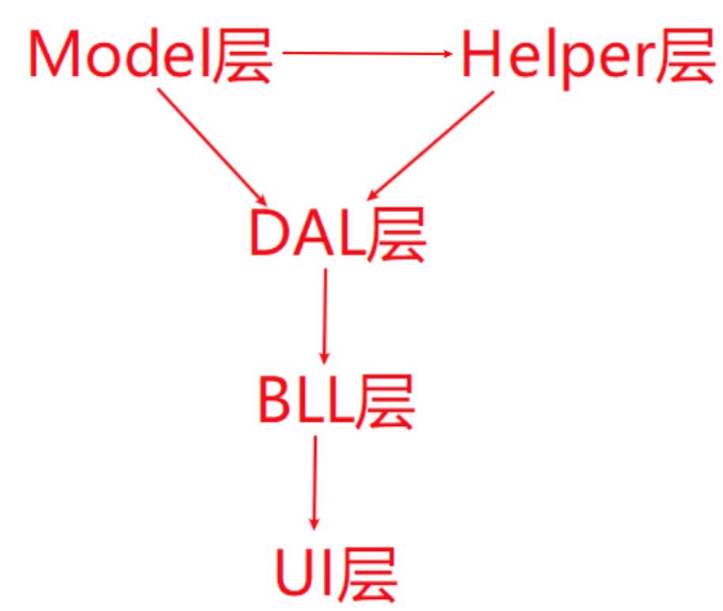

# 架构（3+2）
---
三层架构
- 数据访问层DAL
- 业务逻辑层BLL
- 界面表示层UI

两层架构
- 数据实体层Model
- 工具帮助层Helper

# Package
---

## UI

---

```html
 <ItemGroup>
   <PackageReference Include="IoTClient" Version="1.0.40" />
   <PackageReference Include="MiniExcel" Version="1.34.2" />
   <PackageReference Include="SunnyUI" Version="3.7.2" />
   <PackageReference Include="SunnyUI.Common" Version="3.7.2" />
 </ItemGroup>
```


## Model

---

```html
 <ItemGroup>
   <PackageReference Include="Mapster" Version="7.4.0" />
   <PackageReference Include="Mapster.Core" Version="1.2.1" />
   <PackageReference Include="Microsoft.Extensions.Configuration" Version="8.0.0" />
   <PackageReference Include="Microsoft.Extensions.Configuration.Json" Version="8.0.1" />
   <PackageReference Include="NLog.Extensions.Logging" Version="5.3.14" />
 </ItemGroup>
```


# Ref

---




依赖关系:依赖具有传递性
UI层依赖BLL层，DAL层，Model层，Helper层
BLL层依赖DAL层，Model层，Helper层
DAL层依赖Model层，Helper层
Helper层依赖Model层


# PLC 点表分析

---

| 名称 | PCL地址    | 类型 |
| ---- | ---------- | ---- |
|      | DB1.DBX1.0 | Bool |
|      | DB1.DBX1.1 |      |
|      | DB1.DBX2.0 |      |


I、Q、M则代表不同类型的存储区 

I：输入存储区，接收外部输入信号，比如传感器

Q:输出存储区，输出信号到外部负载，如继电器、指示灯 

M:中间存储区，用于存储程序执行过程中的**中间状态** 

DB1.DBX1.7代表的是：数据块DB1中第1个字节的第7位。

- 这里的DB1指的是数据块的编号为1，DBX表示数据块中的数据位，1.7表示第1个字节的第7位。
- 这种表示方法用于访问和操作数据块中的具体位。


